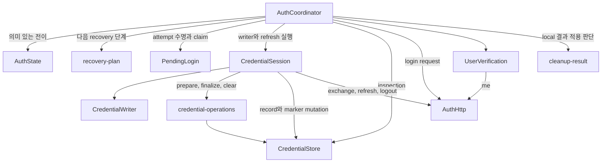

# Desktop Auth Core

Desktop main 인증 core는 `apps/desktop/src/backend/auth`에 있고, 제품 composition은 `apps/desktop/src/backend/main.ts`와 `auth/runtime-config.ts`, `auth/runtime-effects.ts`, `auth/bootstrap.ts`가 담당한다. 완전한 trusted runtime 설정이 없거나 유효하지 않으면 auth effects, protocol ingress, store, network를 만들지 않고 현재 renderer의 연결 실패 안내를 사용한다. 설정이 유효하면 main은 lock 전에 app identity와 userData profile directory를 준비하고 profile을 적용한다. Electron이 실제 보관한 `userData`를 즉시 다시 읽어 준비한 canonical path와 exact 비교하고, 이 적용 결과만 ingress·effects·store에 전달한다. Profile 준비 실패는 setter 전 비인증 fallback이고, setter가 시작된 뒤의 불일치는 부분 전역 변경으로 분류해 nonzero 종료한다.

Ready 뒤에는 안내 완료→dependency 생성으로 coordinator를 만든다. 안내가 완료되지 않아 runtime을 만들 수 없으면 protocol ingress를 폐기하되 적용된 profile의 single-instance ownership은 유지한 비인증 window로 전환한다. Dependency·clock·coordinator 생성과 이후 owned composition의 예상 밖 예외는 이 fallback으로 축약하지 않고 ingress를 폐기한 뒤 nonzero 종료한다. 정상적인 저장소·network 복원 실패는 `storageBlocked` 또는 `restorePaused` 같은 terminal/retry 상태로 resolve하고, owner가 active인 동안의 예상 밖 `start()` rejection도 같은 fatal 경계를 사용해 영구 `restoring`을 남기지 않는다. `before-quit`과 `will-quit`은 취소 가능한 시도로 취급해 새 activation과 뒤늦은 구성을 잠시 막되 protocol ingress는 폐기하지 않는다. Event, window `close` 또는 renderer `beforeunload`가 종료를 취소하면 active 상태를 복구하고 보류한 owned failure를 다시 처리하며, `quit`이 실제 종료를 확정한 뒤에만 ingress를 폐기한다. Notice/bootstrap 또는 성공한 `start()`가 quit 시도 중 끝나면 결과를 버리지 않는다. Bootstrap composition과 이미 받은 protocol callback/activation은 quit 결과까지 보류하고, 취소 시 한 번 재개하며 확정 종료 시 폐기한다. 확정된 정상 quit 뒤의 늦은 rejection은 종료 상태를 바꾸지 않는다. Notice 대기 중 quit이 시작되면 dependency·IPC·window·restore를 뒤늦게 만들지 않는다. Window는 permission·capture/auth IPC·navigation handler와 document load 시작이 모두 구성된 뒤에만 current owner로 공개한다. 동기 구성 실패는 등록한 auth IPC와 미공개 window를 rollback하며, current owned window의 document load rejection은 nonzero 종료한다. 다만 cancelable `close` 시도 중 겹친 rejection은 보류하고 `closed`가 실제 종료를 확정하면 폐기한다. 동기 `close` 취소나 renderer `beforeunload` 취소가 확인되면 같은 rejection을 다시 fatal 경계에서 처리한다. 이미 교체됐거나 확정된 정상 quit 뒤에 도착한 늦은 rejection은 현재 owner를 건드리지 않는다. Auth IPC는 current window·webContents·main frame이 모두 살아 있고 frame이 attached 상태의 exact document이며 sender identity도 일치할 때만 허용한다. Window·auth/capture IPC·activate lifecycle을 먼저 연결한 뒤 `start()`로 restore를 시작하고, protocol return은 start 성공 뒤에만 전달한다.

Auth coordinator와 character search는 각각 독립된 runtime clock history를 사용합니다. `runtime-clock.ts`는 monotonic 두 번 사이의 wall 표본으로 생성 시 기준과 이후 offset 차이를 비교하고, 표본 불확실성을 포함한 양방향 1,000 ms 예산을 적용합니다. 역행, 과도한 표본 폭, 읽기 실패, 비유한 값 또는 power event가 있으면 이후 읽기에도 `discontinuous`를 유지합니다. 구체적인 허용·신뢰 회복 정책은 [lifecycle Rule](../rules/desktop-auth-lifecycle.md#로컬-clock-신뢰)을 따릅니다.

Main은 ready 뒤 auth effects를 만들 때 power listener를 연결하며, auth fallback과 확정 shutdown에서 제거합니다. 취소된 quit에는 같은 listener를 유지합니다. Clock마다 event revision을 기억하므로 search나 pending 검사의 선행 읽기가 access 검사의 신뢰 상실을 소비하지 않습니다. 현재 search는 `monotonicMs`만 deadline과 Retry-After에 사용하며 `discontinuous`로 검색 상태를 전이하지 않습니다.

Coordinator는 새 login에서 `startTrustPeriod()`를 호출합니다. 최초 restore는 dependency 기준을 유지하고 이후 refresh 요청 직전에는 이전 access를 먼저 신뢰 불가로 고정한 뒤 새 기준을 만듭니다. 새 응답의 저장 확정이 access generation을 교체하지만 clock 기준을 새로 만들지는 않습니다. 따라서 HTTP와 저장 대기 중의 신뢰 상실도 유지됩니다. `AuthClock.startTrustPeriod`가 optional인 것은 기존 fake가 신뢰 입력을 직접 제어하기 위한 것이며 production clock은 항상 구현합니다. 실제 API/provider, OS protocol registry, safeStorage·file durability와 packaged clock/power event 성공은 별도 검증 범위입니다.

## Module 경계

| Path                                                     | 현재 책임                                                                                                                      |
| -------------------------------------------------------- | ------------------------------------------------------------------------------------------------------------------------------ |
| `apps/desktop/src/backend/auth/coordinator.ts`           | command 허용, generation·pending·공개 Promise, resource 무효화와 비동기 결과 적용                                              |
| `apps/desktop/src/backend/auth/auth-state.ts`            | 의미 있는 phase 전이, allowlist snapshot·revision·동기 listener와 recovery 목적                                                |
| `apps/desktop/src/backend/auth/recovery-plan.ts`         | 저장 상태와 실행 시점 access 사실에서 다음 recovery 단계를 선택하는 pure 판단                                                  |
| `apps/desktop/src/backend/auth/user-verification.ts`     | `/me` controller 예약·abort·동일 작업 해제와 정제 실패 notice 분류                                                             |
| `apps/desktop/src/backend/auth/credential-session.ts`    | private credential·known refresh, writer·HTTP 진행, refresh 공유 Promise, logout reservation·disposal 결과와 저장 effect       |
| `apps/desktop/src/backend/auth/pending-login.ts`         | private attempt 상태, request TTL·timer, synchronous exchange claim·중복 판정과 폐기                                           |
| `apps/desktop/src/backend/auth/cleanup-result.ts`        | local clear 결과·현재 작업 여부·logout 소유권을 받아 후속 진행 또는 storage 차단 판단                                          |
| `apps/desktop/src/backend/auth/types.ts`                 | main 내부 effect와 snapshot·명령 결과 type                                                                                     |
| `apps/desktop/src/backend/auth/pkce.ts`                  | 32-byte verifier와 ASCII S256 challenge 생성, canonical base64url 검사                                                         |
| `apps/desktop/src/backend/auth/protocol.ts`              | trusted HTTPS API origin, browser launch URL, 등록 return target과 code-only 복귀 URL 검사                                     |
| `apps/desktop/src/backend/auth/http.ts`                  | Ky 기반 고정 auth endpoint request, caller abort와 15초 전체 deadline                                                          |
| `apps/desktop/src/backend/auth/http-response.ts`         | 16,384-byte strict UTF-8 JSON stream과 Zod strict response/error schema                                                        |
| `apps/desktop/src/backend/auth/credential-operations.ts` | durable transition 확립, credential commit, marker 제거·재확립, local clear 결과 합성                                          |
| `apps/desktop/src/backend/auth/runtime-config.ts`        | trusted 설정과 profile filesystem을 검증하고 Electron read-back과 일치한 적용 결과를 반환                                      |
| `apps/desktop/src/backend/auth/runtime-effects.ts`       | config를 자체 캡처하지 않고 bootstrap이 넘긴 적용 설정으로 auth HTTP, macOS credential store, browser, consumer별 clock·entropy·안내를 구성 |
| `apps/desktop/src/backend/auth/runtime-clock.ts`         | 고정 offset 기준, 표본 폭과 power event에 따른 clock 신뢰 구간을 관리                                                                              |
| `apps/desktop/src/backend/auth/bootstrap.ts`             | 단일 trusted config를 effect dependency factory에 전달하고 안내 완료→coordinator runtime을 노출하며, caller가 UI/IPC 뒤 한 번 `start()`하도록 보장 |

Coordinator 생성 시 enabled provider, API origin, 등록 return target과 Browser·HTTP·clock·entropy·credential store effect를 주입한다. Runtime dependency는 `ky@2.1.0`, `zod@4.5.4`로 고정했다. Source와 build에는 운영 origin, owned scheme, app identity의 fixture 기본값이 없다. Composition은 process에 주입된 동일한 trusted runtime config로 고정 HTTP client, coordinator와 `environment/apiOrigin/clientId:"desktop"` store context를 만든다.

현재 process 설정 key는 `LDB_AUTH_API_ORIGIN`, `LDB_AUTH_RETURN_TARGET`, `LDB_AUTH_ENVIRONMENT`, `LDB_AUTH_PROVIDERS`, `LDB_AUTH_APP_IDENTITY`, `LDB_AUTH_USER_DATA_PATH`다. 여섯 값이 모두 exact contract를 통과해야 하며, 제품 provider는 Google만 허용한다. 누락·빈 값·잘못된 provider/URL·identity/profile에는 기본값을 적용하지 않는다. Discord는 공통 synthetic core type에 남아 있지만 미해소 gate가 있어 제품 runtime config에서 거절한다.

`LDB_AUTH_USER_DATA_PATH`는 설정 검증 뒤 lock 이전에 각 path component를 lstat한다. Native path segment의 trailing/repeated separator·`.`·`..` alias, Windows의 non-native `/` 구분자와 Win32가 정규화하는 segment 후행 점·공백, 어느 위치의 symlink도 보정하거나 따라가지 않고 거절한다. 각 existing·created component와 missing component의 direct parent는 native canonical path를 다시 읽어 설정의 exact spelling과 같을 때만 사용하므로, case-insensitive filesystem에서 같은 directory를 가리키는 대소문자 alias도 거절한다. 없는 directory를 0700으로 만들며, missing component의 direct parent를 mutation 전에 다시 확인한다. 이 algorithm이 만들었거나 동시 실행에서 먼저 만들어진 것으로 관측한 component는 검증 완료 뒤 해당 directory, parent와 상위 parent entry를 보강한다. 따라서 다른 동일 algorithm process가 직전에 만든 intermediate를 관측하고 더 깊은 missing component 생성을 이어 가는 경우도 같은 순서로 처리한다. 최종 profile directory와 direct parent도 `setPath` 전에 POSIX directory handle로 sync한다.

기존 POSIX profile directory는 현재 user 소유·0700인지 확인하며 권한을 임의로 변경하지 않는다. 비디렉터리·symlink·권한/파일시스템 오류는 fail closed하고 profile setter를 호출하지 않는다. `setPath` 뒤 즉시 `getPath('userData')`와 exact 비교한 적용 결과만 이후 구성에 사용하며, read-back·name·app identity setter 중 하나라도 실패하면 process를 nonzero로 종료한다. 이 검사는 문자열 provenance와 안정된 component의 순간 상태를 묶지만 inode 수명은 소유하지 않는다. 임의로 이미 존재하던 전체 ancestor chain의 durability, writable ancestor 교체 경쟁, macOS inherited ACL, Windows ACL/reparse point는 trusted anchor와 native 검사 없이는 보장하지 않는다. 실제 배포 tuple의 profile pairwise 분리와 single-instance 독립성은 배포/native gate이고, 모든 filesystem의 전원 손실 durability도 별도 release gate다.

등록 return target은 coordinator 생성 시 검사하며 원문에 `?` 또는 `#`가 있으면 내용이 비어 있어도 거절한다. 설정을 보정하지 않으며, percent-encoded path와 정상 target 뒤의 code-only callback query는 기존 exact 검사로 허용한다.

## Credential 실행 소유권

`CredentialSession`은 credential 채택·사용 차단·참조 해제, known refresh와 disposal evidence의 수명을 함께 소유한다. 같은 module의 `CredentialWriter`가 작업별 completion Promise와 credential HTTP 시작 여부를 소유하며, writer 종료 callback은 같은 reservation일 때만 현재 writer를 해제한다. `runWriter`와 `shareRefresh`는 해당 처리 함수 하나를 실행·공유하고 공개 상태·generation·snapshot setter를 받지 않는다.

Exchange는 PendingLogin의 동기 claim → `exchanging` 알림 → current 재확인 → credential writer 예약 → effect 순서다. 아직 실행하지 않은 claim을 취소한 listener는 같은 stack에서 다음 login을 시작할 수 있다. Refresh 실행 Promise는 작업을 시작하기 전에 등록한다. 공개 logout의 `AuthCommandResult` Promise는 coordinator가 알림 전에 한 번 만들고 같은 flight의 모든 호출에 반환한다.

`prepare`, `writeCredential`, `finalize`, `reestablish`, `releaseUnsentTransition`은 원래 저장 Promise를 그대로 반환한다. 저장 완료를 기다리는 위치와 예외 분류·current generation 확인은 coordinator에 남는다. 추가 Promise 변환 계층으로 인증 실패의 즉시 사용 차단을 늦추지 않으며, 성공과 실패 모두 결과 적용 직전의 generation·logout 소유권을 따른다.

`beginLogout`은 known current/consumed refresh, 기존 writer 참조와 HTTP 시작 여부, 이미 settle됐을 수 있는 disposal Promise를 한 reservation에 고정한다. `finishLogout`은 결과 Promise를 먼저 등록한 뒤 writer 대기·서버 폐기·local clear를 실행해 local/server 확인을 각각 반환한다. Late disposal 실패는 해당 reservation 안에서 합성되며 완료 뒤 다음 session으로 넘기지 않는다. 최종 phase·notice와 generation 확인은 coordinator가 적용한다.

Exchange가 token을 확보하지 못한 채 network/5xx/invalid response로 끝나면 coordinator가 해당 writer에 서버 결과 불명 evidence를 남긴다. Logout은 writer completion 뒤 evidence를 읽으므로 예약 뒤 실패와 실패 후 cleanup 중 예약을 모두 반영한다. 명시적인 `exchange-invalid`와 `network/not-sent`는 제외하며 HTTP 시작 여부나 abort만으로 미전송을 추정하지 않는다. Local clear 성공은 `LOGOUT_SERVER_UNCONFIRMED`, local clear 불명은 `LOCAL_CLEAR_UNCONFIRMED`가 우선이다. 이 evidence는 해당 writer와 이를 captured한 logout 수명에만 남고 다음 session에 전달되지 않는다. 알려진 token의 기존 서버 폐기 흐름은 그대로 사용한다.

## Credential store effect 계약

Store adapter는 `inspect`, `establishTransition`, `commitCredential`, `clearCredential`, `removeTransition`, `reestablishTransition`을 구현한다. Mutation은 `confirmed`, `failed`, `unknown`을 구분한다. Core가 이 결과를 다음처럼 공개 상태에 반영한다.

- `ready` inspection의 refresh만 restore 후보로 사용한다. `unavailable`은 임의 clear 없이 `storageBlocked/SECURE_STORAGE_UNAVAILABLE`이다.
- `recovery-required`는 refresh를 보내지 않고 clear 순서를 실행한다. Clear 전체가 확인되면 `signedOut/REAUTH_REQUIRED`, 확인되지 않으면 `storageBlocked/LOCAL_CLEAR_UNCONFIRMED`다.
- Exchange와 refresh는 transition 확정 뒤에만 HTTP를 보낸다. 새 credential commit과 marker 제거가 모두 확인된 뒤에만 로그인 또는 refresh 성공을 공개한다.
- Exchange는 marker 준비, HTTP 완료, credential commit과 marker finalize 경계에서 pending generation과 fresh clock을 다시 확인한다. Finalize 전 invalidation이면 marker를 유지한다. Finalize 대기 중 만료·불연속·취소로 invalidation됐고 marker가 제거됐다면 durable marker를 재확립한 뒤 known refresh 폐기와 clear로 이동한다. 재확립 실패는 `LOCAL_CLEAR_UNCONFIRMED`로 처리하며 재시작 복원 차단을 보장하지 않는다. 명시 logout이 진행 중이면 해당 logout이 최종 local cleanup과 결과 공개를 소유한다.
- Marker 제거 결과가 불명확하면 marker를 다시 확립한다. 재확립이 확인되면 자동 restore 차단을 유지하며 `TOKEN_SAVE_FAILED`, 재확립도 불명확하면 `LOCAL_CLEAR_UNCONFIRMED`를 우선한다.
- Local clear는 clear transition, credential 삭제, marker 제거가 모두 확인돼야 clean이다. 서버 logout 결과와 독립적으로 판단한다. 로그인 준비·exchange 실패·stale token 정리·restore/retry의 clear 완료 뒤에는 `decideLocalCleanup`이 logout 소유권을 먼저 판단하고, local 결과 불명은 storage 차단, clean 결과는 현재 작업에만 후속 진행을 허용한다. 취소·만료된 attempt의 clean 결과는 기존 상태를 유지한다. 이 pure 함수는 generation이나 snapshot을 변경하지 않으며 coordinator가 `storageBlocked/LOCAL_CLEAR_UNCONFIRMED`와 memory 해제를 적용한다. Transition 준비의 failed/unconfirmed와 token commit/finalize의 저장 실패는 각 저장 단계의 별도 결과를 유지한다.

제품의 macOS credential adapter는 platform Rule의 safeStorage, atomic replacement, file/directory sync, ownership·symlink·permission 검사를 구현한다. 다만 mock의 `confirmed`와 Node IO 성공은 실제 filesystem의 전원 손실 durability나 native ACL·Keychain evidence가 아니며, 그 보장은 별도 release gate다.

## 공개 상태와 recovery 정책

`AuthState`는 login 진행·signedIn/signedOut·복원·저장 차단 등 의미 있는 전이에서 허용된 snapshot을 만든다. State 교체와 revision 증가 뒤 listener를 동기적으로 호출하며 같은 값의 전이도 알림을 생략하지 않는다. `getSnapshot`은 revision을 바꾸지 않고 provider/login/user를 복사한다. `getSnapshot`과 `subscribe`는 분리된 함수로 호출해도 같은 owner를 사용한다. 전이의 반환값은 listener 재진입 이후의 최신 상태가 아니라 그 전이가 발행한 snapshot이므로 기존 command 결과 시점을 유지한다.

Generation은 coordinator 한 곳에서 증감한다. Coordinator는 generation 확인·pending 폐기·credential 사용 차단 등 resource 처리를 수행한 뒤 AuthState 전이를 호출하며, public start/logout Promise도 계속 소유한다. AuthState는 credential·pending·HTTP 작업을 직접 실행하지 않는다.

Recovery 목적은 `inspect-store`, `clear-store`, `resume-credential`로 명시하며 token·verifier·Promise를 담지 않는다. AuthState가 전이와 함께 목적을 보존하고 `recovery-plan`은 저장 상태 또는 이미 조회한 clock/access 만료 사실로 다음 단계만 선택한다. Cleanup 목적으로 재시도한 ready record는 restore하지 않고 clear한다. Retry 자격과 generation은 coordinator가 따로 검사하며, access 단계는 기존처럼 `restoring` 알림과 current 확인 뒤 clock을 읽어 결정한다.

`UserVerification`은 요청별 controller를 예약하고 원래 `/me` Promise를 그대로 반환한다. Coordinator의 await/catch/finally 위치와 generation·credential identity 확인은 유지한다. Logout은 현재 verification을 abort하며, 이전 요청의 finally는 같은 reservation일 때만 current controller를 해제하므로 listener가 시작한 다음 요청의 abort 소유권을 지우지 않는다. 실패 분류는 기존 인증 상실·network·service notice만 반환한다.

## Pending attempt 소유권

`PendingLogin`은 coordinator가 직접 수정하던 request·stage·fingerprint·exchange Promise·controller·timer를 private field로 소유한다. 내부 class는 `acceptRequest`, `claim`, `trackExchange`, `rejectCode`, `resumeWaiting`, `dispose`처럼 수명에 맞는 동작을 제공하고 coordinator의 전체 mutable context나 setter 묶음을 받지 않는다. `snapshot()`은 공개 login allowlist를 복사하며 verifier와 claim의 요청 body는 main 내부에만 남는다.

Constructor는 attempt 상태를 구성한다. Coordinator가 current reference를 등록한 뒤 `scheduleExpiry()`를 호출하므로 초기 clock 만료도 등록된 attempt에서 처리된다. Timer는 expired attempt를 coordinator에 전달하고 coordinator가 같은 reference와 generation인지 확인해 상태를 전이한다. `dispose()`는 timer 취소와 controller abort를 수행하며 이미 queue에 들어간 callback도 disposed 상태에서 종료한다. 동기 `claim()`은 ignored/joined/claimed를 반환하고 claimed의 알림 뒤 current 검사와 writer 시작은 coordinator가 소유한다.

Clock 검사는 wall/monotonic 각각을 마지막으로 수용한 관측과 비교한다. 어느 쪽이든 역행하면 `LOGIN_EXPIRED`이며 동일하거나 정상 증가한 관측만 다음 비교 기준으로 저장한다. Request 수신과 timer 재예약에서도 이 history를 유지한다. Monotonic 600초 상한은 최초 `startedAt`에 고정하고 서버 `expiresAt` wall-clock 조건과 불연속 검사도 별도로 유지한다.

## Lifecycle entry

- Restore는 commit/finalize 뒤와 `/me` 전송·응답 처리 뒤 access 만료·clock 신뢰를 다시 확인한다. 시간 문제가 확인되면 확정 credential을 보존한 `restorePaused/RESTORE_RETRY_REQUIRED`로 끝내고, 해당 access의 신뢰 상실은 다음 credential commit까지 유지한다. 시간 문제가 없는 `RESTORE_RETRY_REQUIRED` retry는 `/me`만 재개하며, 신뢰 상실·만료 retry는 현재 확정 refresh로 한 번 rotation한 뒤 검사를 이어간다.

- `start()`는 store를 한 번 복원한다. Ready refresh를 transition 뒤 한 번 rotate하고 새 credential을 commit한 다음 `GET /me`로 user를 확인해야 `signedIn/home`이 된다.
- `beginLogin(provider)`는 `signedOut`이고 이전 writer가 끝난 때만 local attempt와 독립 PKCE를 만든다. 시작 및 login request 응답 뒤 expiry 재설정에서 무효화된 attempt는 `startingLogin`이나 `waitingBrowser`로 다시 공개하지 않는다. 검증한 login request 응답도 현재 pending이 유지된 경우에만 외부 Browser에 한 번 전달한다.
- `handleReturnUrl(raw)`은 exact registered target과 canonical code만 처리한다. 현재 pending을 동기적으로 claim하고 duplicate는 같은 작업에 합류하며 다른 in-flight code와 최근 거절 code는 재전송하지 않는다. `signedOut`에서 pending 없는 정상 복귀는 exchange 없이 `LOGIN_RESTART_REQUIRED`를 공개하며 복원·로그인된 session은 유지한다.
- `cancelLogin(attemptId)`과 pending expiry는 generation을 먼저 바꾸고 pending을 폐기한다. 늦은 token 응답은 publish·commit하지 않고 known refresh의 서버 폐기와 local clear를 시도한다.
- `authorization()`은 main 내부 보호 기능용이다. 유효 access와 현재 generation을 반환하거나 session별 refresh single-flight 결과를 공유한다. Logout·인증 상실로 generation이 바뀌면 늦은 refresh 결과는 사용할 수 없는 결과가 된다. Refresh의 commit/finalize 완료와 현재 session 검사 뒤 clock/access 만료를 다시 확인한다. 이미 만료됐거나 clock이 불연속이면 해당 access generation을 신뢰 불가로 고정하고 같은 flight에 `unavailable`을 반환하며, 확정된 refresh와 `signedIn` 상태는 보존한다. 다음 명시적 authorization은 현재 refresh로 정상 회전하고 새 credential commit이 새 access generation의 신뢰를 연다.
- 전송됐을 수 있는 refresh가 401, network/timeout, 5xx 또는 malformed response로 끝나면 사용 가능한 credential을 즉시 해제하고 `signingOut`으로 전환해 보호 기능을 차단한다. Durable marker 아래에서 known R0의 서버 logout을 한 번 시도하고 local clear로 재로그인 상태를 확정한다. 정리 중 authorization은 R0를 다시 쓰지 않으며 명시 logout은 같은 known R0의 서버 폐기를 공유한다.
- `retryAuth()`는 `restorePaused`의 현재 단계 또는 `storageBlocked`의 inspection/cleanup만 재개한다. 불명확한 exchange code나 전송됐을 수 있는 refresh를 다시 보내지 않는다. Retry generation은 `restoring` 알림 전에 확보하며, 동기 listener가 logout해 소유권이 바뀌면 HTTP/store 작업을 시작하지 않는다.
- `logout()`은 동시 호출이 결과를 공유한다. Idle session은 durable clear marker를 먼저 확인한 뒤 서버 logout을 보낸다. Refresh HTTP가 이미 시작됐다면 기존 transition marker 아래에서 알고 있는 refresh로 서버 logout을 즉시 시작하고 writer 종료 뒤 clear marker로 교체한다. Marker 준비 전 writer는 무효화·종료하고 clear marker를 먼저 만든다. Local clear 불명은 `LOCAL_CLEAR_UNCONFIRMED`, local clear 성공과 서버 결과 불명은 `LOGOUT_SERVER_UNCONFIRMED`다. Known credential이 없는 동시 logout은 late exchange token의 폐기 실패도 반영하며, 결과는 해당 logout에서 소비해 다음 session으로 넘기지 않는다. Known current/consumed refresh의 서버 logout이 확인되면 같은 session의 새 token 폐기 실패만으로 확인 결과를 뒤집지 않는다.

동기 snapshot listener가 `exchanging` 알림 중 취소하거나 logout하면 claim을 다시 확인해 exchange 저장 작업을 시작하지 않는다. Logout은 `signingOut` 알림 전에 공유 flight를 등록하므로 listener의 재진입도 같은 Promise에 합류한다. Logout의 generation 무효화와 보호 차단은 호출 중 즉시 실행한다.

`getSnapshot()`과 `subscribe()`가 반환하는 값은 `runId`, `revision`, `phase`, `providers`, local login 안내, nickname, entry, notice allowlist뿐이다. Refresh/access, verifier, exchange code, server request/user identity와 raw error는 포함하지 않는다.

## HTTP와 검증 범위

`createAuthHttpClient`는 주입된 exact HTTPS origin에서 `/auth/login-requests`, `/auth/exchange`, `/auth/refresh`, `/auth/logout`, `/me`만 호출한다. Ky instance가 JSON 직렬화·header 병합·Request 생성과 주입된 fetch 호출을 맡는다. Request는 redirect error, no-store, credential omit와 `retry:0`을 사용한다. Ky의 `throwHttpErrors:false`로 원문 error body 자동 읽기를 끄고 모든 응답을 같은 앱 parser에 전달한다. 이미 취소된 signal은 fetch 전에 거절하며 Ky·transport 오류는 고정 `AuthHttpFailure`로 치환한다.

`await ky(...)` 뒤 직접 stream을 읽는 경로에서는 Ky의 shortcut body timeout이 적용되지 않는다. 따라서 Ky의 `timeout`·`totalTimeout`을 끄고 기존 outer deadline이 response header부터 body 완료까지 단일 15초를 소유한다. Strict UTF-8와 누적 16,384-byte 제한은 library의 기본 JSON 읽기로 대체하지 않는다.

Zod `strictObject`가 success와 nested user/error의 exact field·type을 검사하며 `safeParse` 실패의 issue·message·불신 key는 공개하지 않는다. Coercion·unknown key 제거·문자열 보정은 하지 않는다. Access는 크기 제한을 둔 compact JWS 형태, refresh/code는 canonical 32-byte base64url, ID는 UUID, 시간은 UTC ISO, nickname은 well-formed string인지 확인한다. UUID는 기존 shape를 보존하는 `z.guid()`를 사용하고 UTC 시간의 0~3자리 소수초·date round-trip, canonical refresh decode/re-encode, nickname의 well-formed 문자열 검사를 유지한다. ASCII access의 길이와 응답 전체 byte 상한은 별도 경계이며 nickname에 client 길이 제한을 추가하지 않는다. JWT claim이나 server identity는 해석하지 않는다.

Unit test는 Browser·HTTP·clock과 credential/marker 상태를 가진 store fake를 제어해 PKCE, URL, response stream, pending 취소·만료, duplicate/stale 복귀, commit 전 비공개, marker 결과와 재시작 recovery, restore와 `GET /me`, refresh single-flight, logout 경합과 snapshot 비노출을 확인한다. 제품 composition test는 설정 누락/오류의 무활성화, profile 준비/부분 적용, owner/loser, 안내→store→start 순서, notice 중 quit, 예상 밖 구성·active start rejection, file document branch의 close→activate 재연결, partial window rollback과 current/stale/quit load rejection, close와 겹친 rejection의 완료·두 취소 결과, before/will-quit·renderer 취소 뒤 복구와 보류 실패 재처리를 합성 Electron double로 확인한다. Auth IPC test는 current window/webContents/main frame의 생존·attached·exact document와 sender identity를 각각 확인한다. Actual ingress module도 같은 double에 연결해 versioned handoff의 일반 실행·malformed·복수·wrong-scheme·structured option payload·pending 없는 callback 분류, 새 claim 1회와 window 예외 회수를 함께 검사한다. Runtime effects와 실제 macOS credential adapter를 함께 실행한 non-macOS test는 조기 `unavailable`→`storageBlocked`와 safeStorage·fetch 미호출을 확인한다. Filesystem 전역 미호출 전체를 계측한 증거는 아니다. Profile case alias와 POSIX backslash semantics는 주입한 filesystem/path seam으로 어느 host에서나 검사하지만 실제 case-insensitive volume과 native filesystem 관측은 release gate다. 실제 API `GET /me`, native credential store, OS protocol registry, Browser/provider, packaged app은 후속 gate다.
