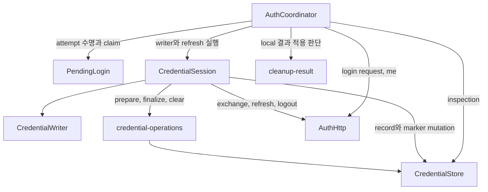

# Desktop Auth Core

Desktop main 인증의 현재 독립 core는 `apps/desktop/src/backend/auth`에 있다. 이 구현은 승인된 `docs/rules/desktop-auth.md`, `docs/rules/desktop-auth-lifecycle.md`, `docs/rules/desktop-auth-platform.md`를 소비한다. `apps/desktop/src/backend/main.ts` bootstrap, protocol/IPC/UI, 실제 `safeStorage`·file adapter에는 아직 연결되지 않았다.

## Module 경계

| Path                                                     | 현재 책임                                                                                                  |
| -------------------------------------------------------- | ---------------------------------------------------------------------------------------------------------- |
| `apps/desktop/src/backend/auth/coordinator.ts`           | command 허용, current attempt·generation, 공개 snapshot과 restore·refresh·logout 결과 적용 |
| `apps/desktop/src/backend/auth/credential-session.ts`    | private credential·known refresh, writer·HTTP 진행, refresh 공유 Promise, logout reservation·disposal 결과와 저장 effect |
| `apps/desktop/src/backend/auth/pending-login.ts`         | private attempt 상태, request TTL·timer, synchronous exchange claim·중복 판정과 폐기 |
| `apps/desktop/src/backend/auth/cleanup-result.ts`        | local clear 결과·현재 작업 여부·logout 소유권을 받아 후속 진행 또는 storage 차단 판단 |
| `apps/desktop/src/backend/auth/types.ts`                 | main 내부 effect와 snapshot·명령 결과 type                                                                 |
| `apps/desktop/src/backend/auth/pkce.ts`                  | 32-byte verifier와 ASCII S256 challenge 생성, canonical base64url 검사                                     |
| `apps/desktop/src/backend/auth/protocol.ts`              | trusted HTTPS API origin, browser launch URL, 등록 return target과 code-only 복귀 URL 검사                 |
| `apps/desktop/src/backend/auth/http.ts`                  | Ky 기반 고정 auth endpoint request, caller abort와 15초 전체 deadline                                                   |
| `apps/desktop/src/backend/auth/http-response.ts`         | 16,384-byte strict UTF-8 JSON stream과 Zod strict response/error schema                                |
| `apps/desktop/src/backend/auth/credential-operations.ts` | durable transition 확립, credential commit, marker 제거·재확립, local clear 결과 합성                      |

Coordinator 생성 시 enabled provider, API origin, 등록 return target과 Browser·HTTP·clock·entropy·credential store effect를 주입한다. Runtime dependency는 `ky@2.1.0`, `zod@4.5.4`로 고정했다. Source에는 운영 origin, owned scheme, app identity가 없다. Composition은 같은 trusted runtime config로 고정 HTTP client와 coordinator를 만들고 실제 platform adapter를 연결해야 한다.

## Credential 실행 소유권

`CredentialSession`은 credential 채택·사용 차단·참조 해제, known refresh와 disposal evidence의 수명을 함께 소유한다. 같은 module의 `CredentialWriter`가 작업별 completion Promise와 credential HTTP 시작 여부를 소유하며, writer 종료 callback은 같은 reservation일 때만 현재 writer를 해제한다. `runWriter`와 `shareRefresh`는 해당 처리 함수 하나를 실행·공유하고 coordinator의 phase·generation·snapshot setter를 받지 않는다.

Exchange는 PendingLogin의 동기 claim → `exchanging` 알림 → current 재확인 → credential writer 예약 → effect 순서다. 아직 실행하지 않은 claim을 취소한 listener는 같은 stack에서 다음 login을 시작할 수 있다. Refresh 실행 Promise는 작업을 시작하기 전에 등록한다. 공개 logout의 `AuthCommandResult` Promise는 coordinator가 알림 전에 한 번 만들고 같은 flight의 모든 호출에 반환한다.

`prepare`, `writeCredential`, `finalize`, `reestablish`, `releaseUnsentTransition`은 원래 저장 Promise를 그대로 반환한다. 저장 완료를 기다리는 위치와 예외 분류·current generation 확인은 coordinator에 남는다. 추가 Promise 변환 계층으로 인증 실패의 즉시 사용 차단을 늦추지 않으며, 성공과 실패 모두 결과 적용 직전의 generation·logout 소유권을 따른다.

`beginLogout`은 known current/consumed refresh, 기존 writer completion과 HTTP 시작 여부, 이미 settle됐을 수 있는 disposal Promise를 한 reservation에 고정한다. `finishLogout`은 결과 Promise를 먼저 등록한 뒤 writer 대기·서버 폐기·local clear를 실행해 local/server 확인을 각각 반환한다. Late disposal 실패는 해당 reservation 안에서 합성되며 완료 뒤 다음 session으로 넘기지 않는다. 최종 phase·notice와 generation 확인은 coordinator가 적용한다.

## Credential store effect 계약

Store adapter는 `inspect`, `establishTransition`, `commitCredential`, `clearCredential`, `removeTransition`, `reestablishTransition`을 구현한다. Mutation은 `confirmed`, `failed`, `unknown`을 구분한다. Core가 이 결과를 다음처럼 공개 상태에 반영한다.

- `ready` inspection의 refresh만 restore 후보로 사용한다. `unavailable`은 임의 clear 없이 `storageBlocked/SECURE_STORAGE_UNAVAILABLE`이다.
- `recovery-required`는 refresh를 보내지 않고 clear 순서를 실행한다. Clear 전체가 확인되면 `signedOut/REAUTH_REQUIRED`, 확인되지 않으면 `storageBlocked/LOCAL_CLEAR_UNCONFIRMED`다.
- Exchange와 refresh는 transition 확정 뒤에만 HTTP를 보낸다. 새 credential commit과 marker 제거가 모두 확인된 뒤에만 로그인 또는 refresh 성공을 공개한다.
- Exchange는 marker 준비, HTTP 완료, credential commit과 marker finalize 경계에서 pending generation과 fresh clock을 다시 확인한다. Finalize 전 invalidation이면 marker를 유지한다. Finalize 대기 중 만료·불연속·취소로 invalidation됐고 marker가 제거됐다면 durable marker를 재확립한 뒤 known refresh 폐기와 clear로 이동한다. 재확립 실패는 `LOCAL_CLEAR_UNCONFIRMED`로 처리하며 재시작 복원 차단을 보장하지 않는다. 명시 logout이 진행 중이면 해당 logout이 최종 local cleanup과 결과 공개를 소유한다.
- Marker 제거 결과가 불명확하면 marker를 다시 확립한다. 재확립이 확인되면 자동 restore 차단을 유지하며 `TOKEN_SAVE_FAILED`, 재확립도 불명확하면 `LOCAL_CLEAR_UNCONFIRMED`를 우선한다.
- Local clear는 clear transition, credential 삭제, marker 제거가 모두 확인돼야 clean이다. 서버 logout 결과와 독립적으로 판단한다. 로그인 준비·exchange 실패·stale token 정리·restore/retry의 clear 완료 뒤에는 `decideLocalCleanup`이 logout 소유권을 먼저 판단하고, local 결과 불명은 storage 차단, clean 결과는 현재 작업에만 후속 진행을 허용한다. 취소·만료된 attempt의 clean 결과는 기존 상태를 유지한다. 이 pure 함수는 generation이나 snapshot을 변경하지 않으며 coordinator가 `storageBlocked/LOCAL_CLEAR_UNCONFIRMED`와 memory 해제를 적용한다. Transition 준비의 failed/unconfirmed와 token commit/finalize의 저장 실패는 각 저장 단계의 별도 결과를 유지한다.

실제 adapter는 platform Rule의 safeStorage, atomic replacement, file/directory durability, ownership·symlink·permission 검사를 별도 구현해야 한다. 현재 mock의 `confirmed`는 native durability evidence가 아니다.

## Pending attempt 소유권

`PendingLogin`은 coordinator가 직접 수정하던 request·stage·fingerprint·exchange Promise·controller·timer를 private field로 소유한다. 내부 class는 `acceptRequest`, `claim`, `trackExchange`, `rejectCode`, `resumeWaiting`, `dispose`처럼 수명에 맞는 동작을 제공하고 coordinator의 전체 mutable context나 setter 묶음을 받지 않는다. `snapshot()`은 공개 login allowlist를 복사하며 verifier와 claim의 요청 body는 main 내부에만 남는다.

Constructor는 attempt 상태를 구성한다. Coordinator가 current reference를 등록한 뒤 `scheduleExpiry()`를 호출하므로 초기 clock 만료도 등록된 attempt에서 처리된다. Timer는 expired attempt를 coordinator에 전달하고 coordinator가 같은 reference와 generation인지 확인해 상태를 전이한다. `dispose()`는 timer 취소와 controller abort를 수행하며 이미 queue에 들어간 callback도 disposed 상태에서 종료한다. 동기 `claim()`은 ignored/joined/claimed를 반환하고 claimed의 알림 뒤 current 검사와 writer 시작은 coordinator가 소유한다.

## Lifecycle entry

- `start()`는 store를 한 번 복원한다. Ready refresh를 transition 뒤 한 번 rotate하고 새 credential을 commit한 다음 `GET /me`로 user를 확인해야 `signedIn/home`이 된다.
- `beginLogin(provider)`는 `signedOut`이고 이전 writer가 끝난 때만 local attempt와 독립 PKCE를 만든다. 시작 및 login request 응답 뒤 expiry 재설정에서 무효화된 attempt는 `startingLogin`이나 `waitingBrowser`로 다시 공개하지 않는다. 검증한 login request 응답도 현재 pending이 유지된 경우에만 외부 Browser에 한 번 전달한다.
- `handleReturnUrl(raw)`은 exact registered target과 canonical code만 처리한다. 현재 pending을 동기적으로 claim하고 duplicate는 같은 작업에 합류하며 다른 in-flight code와 최근 거절 code는 재전송하지 않는다. `signedOut`에서 pending 없는 정상 복귀는 exchange 없이 `LOGIN_RESTART_REQUIRED`를 공개하며 복원·로그인된 session은 유지한다.
- `cancelLogin(attemptId)`과 pending expiry는 generation을 먼저 바꾸고 pending을 폐기한다. 늦은 token 응답은 publish·commit하지 않고 known refresh의 서버 폐기와 local clear를 시도한다.
- `authorization()`은 main 내부 보호 기능용이다. 유효 access와 현재 generation을 반환하거나 session별 refresh single-flight 결과를 공유한다. Logout·인증 상실로 generation이 바뀌면 늦은 refresh 결과는 사용할 수 없는 결과가 된다.
- 전송됐을 수 있는 refresh가 401, network/timeout, 5xx 또는 malformed response로 끝나면 사용 가능한 credential을 즉시 해제하고 `signingOut`으로 전환해 보호 기능을 차단한다. Durable marker 아래에서 known R0의 서버 logout을 한 번 시도하고 local clear로 재로그인 상태를 확정한다. 정리 중 authorization은 R0를 다시 쓰지 않으며 명시 logout은 같은 known R0의 서버 폐기를 공유한다.
- `retryAuth()`는 `restorePaused`의 현재 단계 또는 `storageBlocked`의 inspection/cleanup만 재개한다. 불명확한 exchange code나 전송됐을 수 있는 refresh를 다시 보내지 않는다. Retry generation은 `restoring` 알림 전에 확보하며, 동기 listener가 logout해 소유권이 바뀌면 HTTP/store 작업을 시작하지 않는다.
- `logout()`은 동시 호출이 결과를 공유한다. Idle session은 durable clear marker를 먼저 확인한 뒤 서버 logout을 보낸다. Refresh HTTP가 이미 시작됐다면 기존 transition marker 아래에서 알고 있는 refresh로 서버 logout을 즉시 시작하고 writer 종료 뒤 clear marker로 교체한다. Marker 준비 전 writer는 무효화·종료하고 clear marker를 먼저 만든다. Local clear 불명은 `LOCAL_CLEAR_UNCONFIRMED`, local clear 성공과 서버 결과 불명은 `LOGOUT_SERVER_UNCONFIRMED`다. Known credential이 없는 동시 logout은 late exchange token의 폐기 실패도 반영하며, 결과는 해당 logout에서 소비해 다음 session으로 넘기지 않는다. Known current/consumed refresh의 서버 logout이 확인되면 같은 session의 새 token 폐기 실패만으로 확인 결과를 뒤집지 않는다.

동기 snapshot listener가 `exchanging` 알림 중 취소하거나 logout하면 claim을 다시 확인해 exchange 저장 작업을 시작하지 않는다. Logout은 `signingOut` 알림 전에 공유 flight를 등록하므로 listener의 재진입도 같은 Promise에 합류한다. Logout의 generation 무효화와 보호 차단은 호출 중 즉시 실행한다.

`getSnapshot()`과 `subscribe()`가 반환하는 값은 `runId`, `revision`, `phase`, `providers`, local login 안내, nickname, entry, notice allowlist뿐이다. Refresh/access, verifier, exchange code, server request/user identity와 raw error는 포함하지 않는다.

## HTTP와 검증 범위

`createAuthHttpClient`는 주입된 exact HTTPS origin에서 `/auth/login-requests`, `/auth/exchange`, `/auth/refresh`, `/auth/logout`, `/me`만 호출한다. Ky instance가 JSON 직렬화·header 병합·Request 생성과 주입된 fetch 호출을 맡는다. Request는 redirect error, no-store, credential omit와 `retry:0`을 사용한다. Ky의 `throwHttpErrors:false`로 원문 error body 자동 읽기를 끄고 모든 응답을 같은 앱 parser에 전달한다. 이미 취소된 signal은 fetch 전에 거절하며 Ky·transport 오류는 고정 `AuthHttpFailure`로 치환한다.

`await ky(...)` 뒤 직접 stream을 읽는 경로에서는 Ky의 shortcut body timeout이 적용되지 않는다. 따라서 Ky의 `timeout`·`totalTimeout`을 끄고 기존 outer deadline이 response header부터 body 완료까지 단일 15초를 소유한다. Strict UTF-8와 누적 16,384-byte 제한은 library의 기본 JSON 읽기로 대체하지 않는다.

Zod `strictObject`가 success와 nested user/error의 exact field·type을 검사하며 `safeParse` 실패의 issue·message·불신 key는 공개하지 않는다. Coercion·unknown key 제거·문자열 보정은 하지 않는다. Access는 크기 제한을 둔 compact JWS 형태, refresh/code는 canonical 32-byte base64url, ID는 UUID, 시간은 UTC ISO, nickname은 well-formed string인지 확인한다. UUID는 기존 shape를 보존하는 `z.guid()`를 사용하고 UTC 시간의 0~3자리 소수초·date round-trip, canonical refresh decode/re-encode, nickname의 well-formed 문자열 검사를 유지한다. ASCII access의 길이와 응답 전체 byte 상한은 별도 경계이며 nickname에 client 길이 제한을 추가하지 않는다. JWT claim이나 server identity는 해석하지 않는다.

Unit test는 Browser·HTTP·clock과 credential/marker 상태를 가진 store fake를 제어해 PKCE, URL, response stream, pending 취소·만료, duplicate/stale 복귀, commit 전 비공개, marker 결과와 재시작 recovery, restore와 `GET /me`, refresh single-flight, logout 경합과 snapshot 비노출을 확인한다. 실제 API `GET /me`, native credential store, OS protocol, Browser/provider, packaged app, IPC/UI/capture 연결은 후속 gate다.
