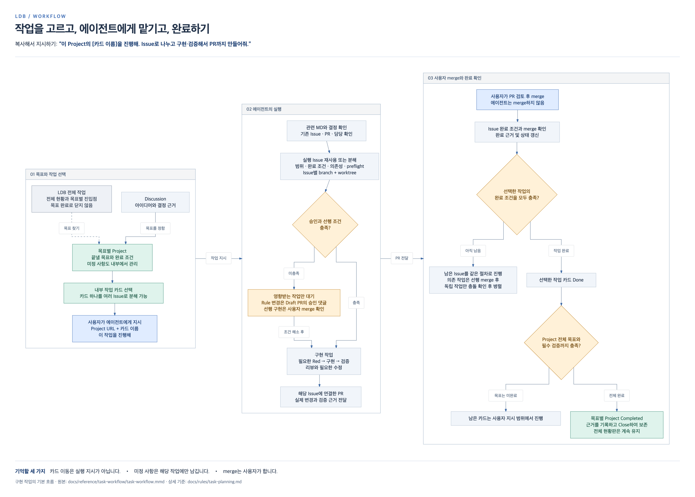

# LDB 작업을 다시 맡기는 방법

기억이나 이전 대화가 없어도 **전체 현황판에서 목표와 작업을 고르고, 에이전트에게 Project 링크와 카드 이름을 주면 됩니다.** 이 안내는 승인된 구현 작업 흐름을 요약한 Reference입니다. 실제 작업에서는 현재 Rule과 해당 작업의 최신 계약을 확인합니다.



[Mermaid 원본](task-workflow.mmd) · [PNG 원본](task-workflow.png) · [전체 개발 현황](https://github.com/users/blahaj94/projects/1)

## 기억이 안 나면 이 문장부터

LDB 프로젝트의 Codex task에서 아래 문장을 보냅니다. 작업 선택을 돕는 요청이며 구현을 시작하라는 지시는 아닙니다.

```text
docs/reference/task-workflow/README.md를 읽고 현재 작업 방식을 확인해줘.
전체 현황판과 목표별 Project에서 남은 작업을 확인해서 다음에 할 일을 추천해줘.
```

진행할 카드를 골랐다면 다음 문장의 링크와 이름을 바꿔서 보냅니다.

```text
<Project URL>

여기의 '<카드 이름>' 작업을 진행해.
기존 Issue를 확인하고 실행 가능한 단위로 나눠서,
구현·검증한 뒤 연결된 PR까지 만들어줘.
```

에이전트가 관련 MD와 결정, 기존 Issue 및 담당을 확인하고 실행 Issue를 재사용하거나 분해합니다. 사용자가 Issue를 미리 만들 필요는 없습니다. 여러 에이전트에게 맡길 때는 맡을 카드를 구분하고, 선행 결과와 수정 범위 및 자원이 독립적인 작업만 동시에 진행합니다. 같은 카드나 변경 범위를 중복 배정하지 않습니다.

## 그림을 읽을 때

- **전체 현황판**은 제품 개발, 리팩토링과 후속 구상의 진입점입니다. 목표 하나가 끝났다고 전체 현황판을 닫지 않습니다.
- **목표별 Project**는 완료 가능한 결과 하나를 관리합니다. 내부 카드 하나가 여러 실행 Issue로 나뉠 수 있습니다.
- 카드 이동이나 Issue 생성만으로 실행을 시작하지 않습니다. 사용자 실행 지시와 기존 승인 및 선행 조건을 확인합니다.
- 필요한 Rule 변경은 Draft PR의 사용자 `승인` 댓글을 확인합니다. 범위 확대나 미정 사항은 영향받는 부분만 확인하고 독립 작업은 계속할 수 있습니다.
- 구현 PR은 사용자가 merge합니다. 선행 결과가 필요한 다음 Issue는 그 merge와 인계를 확인한 뒤 진행합니다.
- Issue, 선택한 작업, Project 목표의 완료를 차례로 확인합니다. 필수 보류나 미검증 항목을 남긴 채 Project를 완료 처리하지 않습니다. 목표 완료 후 근거를 기록하고 Close하여 보존합니다.

그림은 구현 작업의 기본 경로입니다. 명확한 작은 직접 요청은 계획용 Discussion이나 Project 없이 기존 Issue 절차를 사용할 수 있습니다. 설계와 조사 작업의 완료 조건은 작업 유형별 Rule을 따릅니다. 실제 역할 배정, 필요한 Red-Green, review와 validation 의무는 아래 원본에서 확인합니다.

## 원본 규칙과 기록

- [목표별 계획과 작업 착수](../../rules/task-planning.md): 기록별 책임, 작업 분해, 실행 지시와 완료 기준
- [변경과 승인 절차](../../rules/change-control.md): preflight, 승인, branch와 worktree, commit과 사용자 merge
- [실행 Issue와 역할](../../rules/agent-workflow.md): 실행 계약과 역할의 책임
- [배정과 완료 기준](../../rules/agent-execution.md): 소유권, 의존성, 작업 유형별 완료와 인계
- [검증 기준](../../rules/testing.md): Red-Green과 validation

이관 작업의 현재 대응표는 이관 담당 Issue 본문에서 지정한 댓글 하나를 확인합니다. Project와 Discussion의 링크를 따라 원본으로 가며 여러 표를 현재 상태로 복제하지 않습니다. 이 그림은 대응표나 별도 승인 근거가 아닙니다.

## 그림 수정과 다시 생성

단일 Mermaid 원본은 `task-workflow.mmd`입니다. 원본을 수정하고 PNG를 다시 생성한 뒤 한글, 화살표와 분기, 잘림 여부를 직접 확인합니다. PNG만 따로 고치지 않습니다.

[beautiful-mermaid](https://github.com/lukilabs/beautiful-mermaid) **1.1.3**의 `renderMermaidSVG`로 SVG를 만들고, Playwright **1.62.1**과 Chrome으로 PNG를 캡처했습니다. 밝은 테마와 `Apple SD Gothic Neo` 글꼴, 2배 해상도를 사용했습니다. 아래 도구는 임시 디렉터리에 설치하므로 제품 dependency와 lockfile을 바꾸지 않습니다.

저장소 루트에서 실행합니다. Chrome 경로는 환경에 맞게 지정합니다. 다른 OS에서는 설치된 한글 글꼴에 맞춰 아래 렌더러의 font와 CSS도 함께 바꿉니다.

```bash
export LDB_FLOW_DIR="$(git rev-parse --show-toplevel)/docs/reference/task-workflow"
export LDB_CHROME_PATH="/Applications/Google Chrome.app/Contents/MacOS/Google Chrome"
LDB_RENDER_DIR="$(mktemp -d)"
cd "$LDB_RENDER_DIR"
npm install --ignore-scripts --no-audit --no-fund beautiful-mermaid@1.1.3 playwright@1.62.1
```

이 디렉터리에 아래 코드를 `render.mjs`로 저장하고 `node render.mjs`를 실행합니다. 시스템 Chrome이 없다면 `npx playwright install chromium`으로 렌더링용 브라우저를 준비하고 `LDB_CHROME_PATH`를 해제합니다. 그림 내용과 캡처용 머리말 및 꼬리말은 로컬에서 처리하며 외부 폰트를 요청하지 않습니다.

```javascript
import { readFile } from 'node:fs/promises'
import { renderMermaidSVG } from 'beautiful-mermaid'
import { chromium } from 'playwright'
const dir = process.env.LDB_FLOW_DIR
if (!dir) throw new Error('LDB_FLOW_DIR을 지정하세요.')
const source = await readFile(`${dir}/task-workflow.mmd`, 'utf8')
const rendered = renderMermaidSVG(source, {
  bg: '#ffffff', fg: '#24344b', accent: '#416da8', line: '#8395aa',
  muted: '#50647d', surface: '#f1f5fa', border: '#b4c3d3',
  font: 'Apple SD Gothic Neo', padding: 28, nodeSpacing: 26, layerSpacing: 32
})
const svg = rendered.replace(/@import[^;]+;/g, '')
const browser = await chromium.launch({ headless: true, executablePath: process.env.LDB_CHROME_PATH || chromium.executablePath() })
try {
  const page = await browser.newPage({ viewport: { width: 2400, height: 1800 }, deviceScaleFactor: 2 })
  await page.setContent(`<html lang="ko"><head><meta charset="utf-8"><style>
  *{box-sizing:border-box}body{margin:0;background:#fff;color:#24344b;font-family:'Apple SD Gothic Neo',sans-serif}
  main{display:inline-block;padding:36px 40px 28px;background:#fff}
  .eyebrow{font-size:13px;font-weight:700;letter-spacing:2px;color:#4673b8;margin-bottom:8px}
  h1{font-size:30px;letter-spacing:-1px;margin:0 0 10px}p{font-size:15px;line-height:1.6;margin:0}
  header{border-bottom:1px solid #d7e0ec;padding-bottom:20px;margin-bottom:14px}
  svg{display:block}footer{border-top:1px solid #d7e0ec;padding-top:16px;margin-top:16px;font-size:14px;line-height:1.65}
  b{color:#183b70}.hint{color:#64748b;font-size:12px;margin-top:7px}
  </style></head><body><main><header><div class="eyebrow">LDB / WORKFLOW</div><h1>작업을 고르고, 에이전트에게 맡기고, 완료하기</h1><p>복사해서 지시하기: <b>“이 Project의 [카드 이름]을 진행해. Issue로 나누고 구현·검증해서 PR까지 만들어줘.”</b></p></header>${svg}<footer><b>기억할 세 가지</b>　카드 이동은 실행 지시가 아닙니다.　•　미정 사항은 해당 작업에만 남깁니다.　•　merge는 사용자가 합니다.<div class="hint">구현 작업의 기본 흐름 · 원본: docs/reference/task-workflow/task-workflow.mmd · 상세 기준: docs/rules/task-planning.md</div></footer></main></body></html>`)
  await page.evaluate(() => document.fonts.ready)
  const dimensions = await page.locator('main').boundingBox()
  await page.setViewportSize({ width: Math.ceil(dimensions.width), height: Math.ceil(dimensions.height) })
  await page.locator('main').screenshot({path: `${dir}/task-workflow.png`})
  console.log(JSON.stringify({dimensions, svgLength:svg.length}))
} finally { await browser.close() }
```
