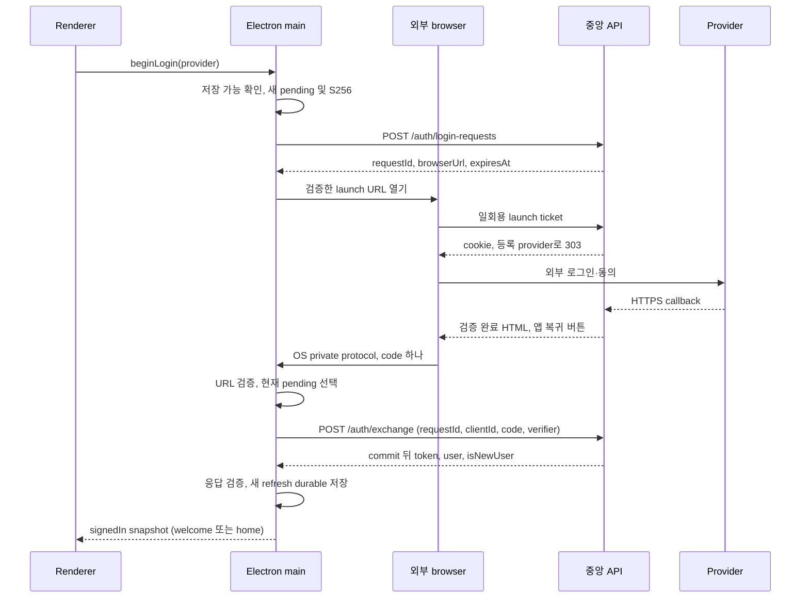

# Desktop Authentication Lifecycle — 승인 대기

승인 상태와 process/IPC/화면은 [Desktop contract](desktop-auth.md), OS·durable write protocol은 [platform](desktop-auth-platform.md)이 canonical source다. 아래 상태는 제안이며 현재 구현·실행 evidence가 아니다. 서버의 [auth API](auth-api.md)·[OAuth](auth-oauth.md)·[session](auth-session.md)·[활동](auth-activity.md) 계약을 그대로 소비한다.

## 상태·credential 수명

| 항목 | 위치·생성 | 수명·폐기 |
| --- | --- | --- |
| 앱 PKCE verifier | main memory, beginLogin마다 32-byte CSPRNG canonical base64url 43자. S256 challenge는 ASCII verifier의 SHA-256 | pending attempt 하나에만 결합. 취소·request 만료·정상 exchange 종료·재시작 시 폐기; file/IPC 저장 없음 |
| Pending login | main memory: local attemptId/generation, server requestId, provider/client, verifier, request expiresAt, clock 기준, 상태/abort controller, 진행 중 exchange·최근 거절 code fingerprint | 한 번에 하나. App main 종료 시 복구하지 않음. Renderer reload·macOS 창 닫힘처럼 main이 살아 있으면 유지 |
| Browser launch URL | main memory의 검증된 HTTPS URL | openExternal에 1회 전달 뒤 참조 해제. 브라우저 열기 실패/취소에서도 새 request로 재시작하며 재사용하지 않음 |
| 복귀 exchange code | main parser→진행 중 exchange body memory | 입력 검증·현재 pending과 교환하는 동안만. 성공/실패/취소/timeout 뒤 raw 참조 해제. 중복 방지 fingerprint는 pending 수명만 유지 |
| Access JWT | main memory, exchange/refresh 응답에서만 | 서버 만료 시각까지의 요청용. 파일에 보관하지 않고 logout·인증 상실·main 종료 시 폐기. Client가 JWT를 새로 발급/수정하거나 user identity source로 해석하지 않음 |
| Refresh token | main memory + safeStorage 암호화 credential file | rotation 전 durable marker, 새 응답 저장 후 교체. Logout·401·결과 불명·저장 실패 시 재사용 금지. 정확한 저장 순서는 platform 문서 |
| User·entry | main memory의 검증된 exchange `/me` 결과 | signedIn 동안만. 디스크 profile cache 없음. 재시작은 refresh 뒤 `/me`; isNewUser는 새 exchange의 안내 분기에만 사용 |

Provider token·secret·state·nonce·provider verifier는 Desktop에 오지 않는다. JS string/Buffer 참조 해제를 즉시 zeroization 또는 OS/browser history 삭제 보장으로 표현하지 않는다. 모든 main/renderer/IPC/protocol/HTTP 진단은 auth-api의 log allowlist를 따른다. Raw URL/argv/body/response/error object를 log·crash breadcrumb에 넣지 않는다.

## 단일 coordinator와 경합

- Main bootstrap에서 단일 인스턴스 ownership을 먼저 얻는다. Auth state·credential file을 쓰는 주체는 그 main 하나다. OS event 등록·cold/warm 차이는 platform 문서를 따른다.
- Auth generation은 로그인 시작/취소, 복원 포기, logout, session 무효화 때 증가한다. 모든 HTTP·저장 작업은 시작 generation을 기억하고 완료 시 다시 검사한다. 늦은 성공이 새 계정이나 signedOut을 덮지 않는다.
- Credential mutation은 한 queue/critical section에서 직렬화한다. In-flight 작업이 끝나거나 timeout으로 결과 불명 처리·marker 유지가 확정되기 전 새 login/refresh writer를 시작하지 않는다. Late response 처리도 이 경계를 거친다.
- Renderer가 새로 열리면 snapshot을 읽는다. UI 부재 때문에 main pending을 새로 만들거나 callback을 renderer로 보내지 않는다. 정상 quit도 verifier를 저장하지 않는다.

## 브라우저 로그인과 앱 복귀

1. `signedOut → startingLogin`: enabled provider와 저장 준비/이전 marker 정리를 확인한다. 준비 실패면 browser/서버 요청 없이 storageBlocked다. 새 attempt/verifier를 만들고 `{provider,clientId:"desktop",codeChallenge,codeChallengeMethod:"S256"}`만 보낸다.
   - 생성 요청의 network/15초 timeout은 `signedOut/NETWORK_UNAVAILABLE`, 500/503은 `signedOut/AUTH_SERVICE_UNAVAILABLE`, 400·예상 밖 status·malformed/invalid 201은 `signedOut/LOGIN_RESTART_REQUIRED`로 끝낸다. 모두 pending/verifier를 폐기하고 browser 호출·자동 retry는 0이다. 응답을 못 받은 request row는 서버 TTL로 종료되며 이 endpoint는 session을 생성하지 않는다.
   - 생성 응답 처리 및 openExternal 직전에 현재 attempt/generation을 재검사한다. 취소/만료 뒤 늦게 온 201은 URL을 열지 않고 버리며 이미 결정된 상태를 덮지 않는다.
2. 201 응답에서 request UUID, exact launch URL, 유효 UTC ISO expiresAt을 검사한다. 서버 request 전체 TTL 600초를 연장하지 않는다. Main은 요청 시작부터 monotonic 600초 상한과 expiresAt wall-clock 조건 중 먼저 도달한 시점에 pending을 끝낸다. Clock 역행/큰 불연속이 관측되면 새 로그인을 요구한다. 절전 복귀·OS callback·HTTP 완료 때도 시간을 재검사한다. Client countdown은 안내/조기 포기 기준이며 서버의 fresh time 판단을 대체하지 않는다.
3. Pending을 완전히 저장한 뒤 `waitingBrowser`를 발행하고 main이 openExternal을 한 번 호출한다. Resolver 성공은 browser/provider 로그인 성공 증거가 아니다. Renderer로 browserUrl을 보내지 않는다. OS 호출 실패면 pending을 정리하고 `signedOut/BROWSER_OPEN_FAILED`다.
4. Provider callback은 브라우저에서 서버가 처리한다. 완료 HTML의 버튼은 등록 target에 **code 하나**만 싣는다. App은 callback에 requestId/provider/error/state/token이 있다고 가정하지 않는다. Provider 취소·실패/브라우저 닫힘은 앱에 전달되지 않으므로 pending은 사용자의 앱 내 취소 또는 TTL까지 기다린다. Polling이나 서버 취소 endpoint를 추가하지 않는다.
5. OS 복귀를 strict parser로 검증한 뒤 현재 살아 있는 pending 하나를 선택한다. Client/proof/request binding은 `/auth/exchange`가 최종 검증한다. 유효한 pending이 없으면 서버 요청 0: signedOut이면 `LOGIN_RESTART_REQUIRED`, 이미 signedIn/restoring이면 현재 session을 그대로 유지한다. Cold start에서 verifier가 없다는 이유로 저장된 정상 session까지 지우지 않는다.
6. `waitingBrowser → exchanging`: 동기적으로 현재 candidate를 claim하고 아래 durable marker를 확립한 뒤 requestId·clientId·code·verifier를 교환한다. 같은 callback 중복은 기존 작업에 합류하거나 무시하고 두 번째 exchange를 보내지 않는다. 다른 code가 in-flight 중 들어오면 추가 작업을 queue하지 않고 무시한다.
7. 200 응답 전체를 검사하고 아직 같은 generation이면 새 refresh를 durable 저장한다. **저장 완료 전에는 signedIn/event/user 화면을 발행하지 않는다.** 저장 뒤 memory access/user를 publish하고 pending/verifier/code를 폐기한다. 신규 insert winner만 welcome, 나머지는 home이다.
8. `400 LOGIN_EXCHANGE_INVALID`는 code/proof/소비/만료를 구분하지 않는다. 서버 성공을 추정하지 않고 candidate를 폐기한다. 현재 request TTL 안이면 waitingBrowser로 돌아가 `LOGIN_RETURN_INVALID`와 새 로그인 action을 보여주며 verifier를 유지한다. 최근 거절 fingerprint와 같은 복귀는 재전송하지 않는다. 다른 정상 callback이 이후 도착하면 교환할 수 있다. Local request 만료면 signedOut/LOGIN_EXPIRED다. 이 선택은 다른 request의 잘못된 복귀가 현재 pending을 즉시 없애지 않게 한다.
9. 형식/설정 오류·exchange transport/5xx·응답 body 불명/유실은 새 로그인을 요구하고 해당 code를 자동 재시도하지 않는다. 서버 commit됐으나 token을 못 받은 session은 앱에서 폐기할 수 없을 수 있고 서버 30일 미사용 종료를 따른다. 서버에 새 grace/idempotency를 요구하지 않는다.

## Main HTTP 계약

- Trusted 배포 설정의 exact HTTPS API origin과 고정 endpoint만 사용한다. Renderer URL/redirect/proxy 선택을 받지 않는다. 인증 JSON fetch는 credential cookie를 보내지 않고 redirect를 따라가지 않는다. TLS certificate 오류를 무시하지 않는다.
- Login-request/exchange/refresh/logout/`GET /me` 호출 각각은 시작부터 header·body 전체까지 **단일 15초 deadline**, 자동 network retry 0회다. 이는 Desktop 대기 예산 제안이며 서버 TTL·provider 10초·검색 deadline을 바꾸지 않는다. Abort/timeout은 서버 rollback 증거가 아니다. 검색의 별도 예산은 후속 검색 task가 기존 contract에 맞춰 정한다.
- JSON 성공은 최대 16,384-byte stream, strict UTF-8·JSON object·해당 endpoint의 exact field/type을 검사한다. TokenType은 Bearer, refresh는 canonical 32-byte base64url, request/user ID는 UUID, 날짜는 유효 UTC ISO다. accessToken은 nonempty ASCII compact JWS 형태이며 최대 8,192 byte만 허용한다. isNewUser는 boolean으로 검사한다. Nickname은 well-formed string인지 확인하되 서버의 trim/grapheme 결과를 client Unicode version으로 재정의하거나 OCR normalizer로 수정하지 않고 그대로 text 출력한다. Raw 오류는 버린다. Desktop의 응답 size/shape 상한은 서버 request parser와 별개인 새 client 소비 제약이다. 실서버 fixture가 이 상한을 넘으면 임의로 잘라 쓰지 말고 client 계약을 재검토한다.
- JWT 서명 검증/권한 판정은 서버가 수행한다. Main은 HTTPS 응답의 expiry를 scheduling hint로만 쓰고 JWT claim에서 user/session을 복원하지 않는다. 204 logout은 body 없이 처리한다. 알 수 없는 HTTP/code, malformed/truncated response는 성공이 아니다.
- Exchange/refresh에 200을 받았어도 parsing/저장 실패면 새 credential 사용을 중단한다. Raw refresh를 안전하게 식별한 경우에만 아래 폐기를 1회 시도한다. 불완전 body에서 임의 field를 추출해 credential로 사용하지 않는다.

## 재시작과 refresh

1. Bootstrap은 `restoring`이다. Pending/verifier/access는 없다. Store가 비어 있고 marker도 없으면 signedOut. 정상 ready record만 있으면 해독/검증한다. Marker/손상/복호화·보호 backend 오류는 platform의 fail-closed 복구를 따른다.
2. 정상 저장 refresh R0로 main이 refresh single-flight를 시작한다. **전송 전에 durable in-flight marker**를 확립한다. 이후 R0는 이전 파일에 남아 있어도 복원 가능한 credential이 아니다. 새 R1 응답 검증·durable 저장·marker 해제 뒤에만 access를 사용할 수 있다.
3. 복원 시 `/me`를 한 번 호출해 user를 얻은 뒤 signedIn/home으로 전환한다. `/me`는 승인된 계정 활동이며 재시작 시 호출이 30일 활동에 영향을 줄 수 있음을 명시한다. Refresh만 반복하거나 background `/me` heartbeat를 보내지 않는다. Snapshot 조회도 HTTP를 하지 않는다.
4. Refresh 성공 후 `/me`의 network/5xx 실패는 R1을 보존하고 `restorePaused/NETWORK_UNAVAILABLE` 또는 AUTH_SERVICE_UNAVAILABLE이다. retryAuth는 access가 아직 유효하면 `/me`만, 만료됐다면 **현재 R1**으로 새 정상 single-flight 뒤 `/me`를 수행한다. App 시작 시 offline을 확실히 전송 전 알아차린 경우도 R0를 보내지 않고 restorePaused로 둔다. 이미 전송했을 수 있는 실패를 이 예외로 분류하지 않는다.
5. 사용 중에는 보호 HTTP가 필요할 때만 access 만료 안내 시각을 확인해 refresh한다. Concurrent caller는 같은 session generation/refresh Promise 결과를 공유한다. Access가 유효한 동안 sessionExpiresAt 안내값만으로 재로그인을 강제하거나 idle 시간을 연장하지 않는다. Logout·새 로그인 generation은 이전 refresh 결과를 받지 않는다.
6. 보호 기능의 401은 caller가 쓴 access generation을 확인한다. 이미 교체된 access라면 최신 access로, 아니면 한 번의 shared refresh 후에 **허용된 요청만 최대 한 번** 재호출한다. `/me` 같은 read만 자동 재호출한다. Mutation/검색의 replay 정책은 각 feature 계약에서 별도로 정하며 범용 interceptor로 POST/PATCH를 재전송하지 않는다. 두 번째 401은 local 인증 상실이다.
7. Refresh 401, 응답 유실/timeout/5xx·commit 불명, 새 token parsing/저장 실패는 R0 재사용 금지·marker 유지·보호 요청 중단·새 로그인이다. 원인을 공격으로 단정하지 않는다. 모든 대기 caller는 같은 실패를 받고 별도 refresh를 시작하지 않는다. 확실한 서버 rollback일 수 있어도 client에 확정 evidence가 없으면 재시도하지 않는 권장안이다.

## 취소·로그아웃·실패의 최종 동작

| 사건 | Main·저장·서버 동작 | 화면/후속 action |
| --- | --- | --- |
| 앱 내 pending 취소 | generation 증가, HTTP abort, pending 참조 해제. 서버 request 취소/브라우저 종료는 보장하지 않음 | signedOut/LOGIN_CANCELLED. 늦은 URL은 새 로그인 자격을 만들지 못함 |
| Exchange 중 취소 후 token 성공 응답 도착 | signedIn/저장 금지. 완전히 검증한 refresh가 있으면 `/auth/logout` 1회, 실패도 credential 폐기. Network 종료·store 정리 전 새 writer 금지 | 취소 유지. 서버 미확인 session의 idle 종료 한계 공개 |
| Local request TTL 도달·절전 중 만료 | pending을 폐기. 진행 중 exchange가 있어도 취소와 같은 generation 처리 | signedOut/LOGIN_EXPIRED, 새 attempt 필요. Code 60초 TTL은 서버만 최종 판정 |
| Main crash/종료, renderer reload | Main 종료는 pending 폐기·정상 refresh만 복원. Renderer reload는 main snapshot 재조회 | 종료 중 로그인은 처음부터. 이미 저장된 session은 정상 복원 절차 |
| 중복/잘못된 URL, 창 없는 warm 복귀 | Platform parser와 위 pending 선택을 따름. 잘못된 URL은 HTTP·window navigation 0; 현재 인증을 지우지 않음 | 정상 pending 복귀에만 창 생성/복원/focus 후 처리. OS가 focus를 보장한다고 주장하지 않음 |
| Refresh/저장 중 logout | 즉시 generation 증가·보호 요청/capture 차단. 단일 writer와 조정해 이미 알고 있는 마지막 refresh를 선택. Known consumed R0도 logout 자격이므로 R1 도착을 기다려 재사용하지 않음 | signingOut. 늦은 200은 로그인 복구에 사용하지 않음 |
| 현재 기기 logout 정상 | Durable marker→known refresh로 `/auth/logout` 1회→local record/marker 정리→memory 해제. 서버 204만 폐기 확인. Provider revoke 없음 | signedOut. Server logout과 local 정리 모두 확인된 경우에만 완료 안내 |
| Logout 503/timeout/offline, local 정리 성공 | 서버 결과를 추정하지 않고 local credential 사용·보관 중단. 자동 background retry 위해 token을 남기지 않음 | signedOut/LOGOUT_SERVER_UNCONFIRMED: “이 기기 정보는 지웠지만 서버 로그아웃은 확인하지 못했습니다.” |
| Logout local marker/write/delete 실패 | 현재 process token 사용 중단, known token의 서버 logout은 1회 시도 가능. Local 재복원 차단의 durable 성공 여부는 platform 규격으로 구분 | storageBlocked/LOCAL_CLEAR_UNCONFIRMED. 삭제 실패 시 재시작 안전을 보장하지 않음; retryAuth로 local 정리 |
| 새 token 저장 실패 | signedIn 금지/기존 보호 사용 중단, marker 유지·재확립을 확인. 완전한 known refresh로 해당 session logout 1회 시도 후 memory 폐기. Marker 삭제 결과까지 불명인 경우는 platform의 별도 실패 규칙 | 통상 storageBlocked/TOKEN_SAVE_FAILED. Marker 재확립도 실패하면 LOCAL_CLEAR_UNCONFIRMED가 우선. 저장 복구 뒤 새 login; access-only 임시 로그인 없음 |
| `/me` 또는 보호 기능 최종 401 | generation 무효화·local clear. Known refresh가 있으면 session logout 1회 시도 가능; 다른 기기 변화 없음 | signedOut/REAUTH_REQUIRED. 기존 capture unmount |
| signedIn 중 일반 기능 network/5xx | 401로 변환하거나 자동 logout/refresh하지 않음. Feature에 정제 오류 전달 | 기존 계정 표시와 수동 재시도. API 접근 성공·활동 연장을 주장하지 않음 |

Logout은 startingLogin/waitingBrowser에서는 해당 attempt 취소로 처리하고, exchanging에서는 취소 및 late token 폐기 규칙을 따른다. restoring/restorePaused에서는 저장된 현재 credential을 정리하며 `retryAuth`와 동시 실행하지 않는다. 새 로그인은 signedOut과 이전 writer·marker 정리가 확인된 뒤에만 허용한다. Logout server 실패는 다음 login을 막지 않지만 **local 저장 정리 미확인**은 막는다.

Memory에 token이 없는 서버 미수신 session을 찾아 폐기하는 API는 없다. 응답 유실 후 무조건 복구·즉시 서버 취소·앱 종료 후 원래 로그인 계속하기가 제품 요구가 되면 별도 서버/보안 결정이다. 이번 안은 기존 single-use·grace 없음·30일 idle 정책을 그대로 따른다.
